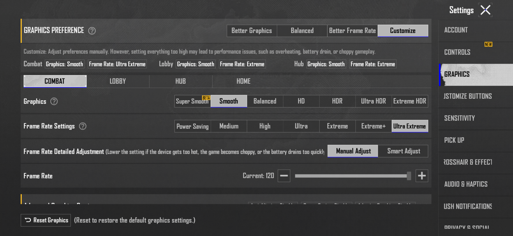

<div align="center">


[](https://github.com/not-GIANT/Flame-Unlocker)
[](https://github.com/topjohnwu/Magisk)
[](https://github.com/not-GIANT/Flame-Unlocker)
[](https://github.com/not-GIANT/Flame-Unlocker/releases)

<h1>🔥 IGNITE YOUR PERFORMANCE 🔥</h1>

**Break free from software-imposed hardware limits.**

Flame Unlocker is a high-performance system configuration module that redefines your gaming experience. By meticulously spoofing your hardware signature as the **Redmagic 11 Pro (NX809J)**, it bypasses FPS caps and graphical restrictions in top-tier mobile titles.

[**Download Latest Release**](https://github.com/not-GIANT/Flame-Unlocker/releases) • [**Report Issues**](https://github.com/not-GIANT/Flame-Unlocker/issues)

---

</div>

## 🚀 Key Advantages

| Feature | Description |
| :--- | :--- |
| **144 FPS Unlock** | Forces games to recognize high-refresh capabilities, enabling ultra-smooth 144Hz output. |
| **Maximized Graphics** | Unlocks UHD, Extreme, and 90/120/144 FPS options in PUBG, BGMI, CODM, and Genshin. |
| **Elite Identity** | Spoofs the **NX809J** (Redmagic 11 Pro) across all system property levels. |
| **Android 15/16 Ready** | Optimized for modern property management in the latest Android builds. |

---

## 🛠️ Technical Profile

The module targets the following system properties to ensure a seamless "Identity Shift":

```bash
# Redmagic 11 Pro Signature (NX809J)
ro.product.model=NX809J
ro.product.odm.model=NX809J
ro.product.system.model=NX809J
ro.product.vendor.model=NX809J
ro.product.system_ext.model=NX809J
```

---

## 📦 Installation 

### **Prerequisites**
*   **Root Access:** Magisk v24.0+ or equivalent.
*   **High Refresh Rate:** A display capable of 90Hz/120Hz/144Hz (Hardware limitation).

### **Steps to Ignite**
1.  **Obtain:** Download the `flame-unlocker.zip` from the [Releases](https://github.com/not-GIANT/Flame-Unlocker/releases) page.
2.  **Manager:** Open your **Magisk App** and navigate to the `Modules` section.
3.  **Deploy:** Select `Install from Storage` and pick the zip file.
4.  **Verify:** Wait for the custom 🔥 **FLAME UNLOCKER** 🔥 banner to appear in the terminal.
5.  **Finalize:** Reboot your device to apply the new system signature.

---

## 📷 Performance Preview

<div align="center">
  
  <p><i>Unlocking peak performance on supported hardware.</i></p>
</div>

---

## ⚠️ Disclaimer & Safety

> [!CAUTION]
> **Performance comes at a cost.** Running games at 144 FPS increases GPU load, power consumption, and thermal output.
> 
> *   This module does **not** overclock hardware; it unlocks software limits.
> *   I am not responsible for hardware fatigue, battery degradation, or account bans.
> *   Always monitor your device temperatures during extended sessions.

---

<div align="center">

### MADE WITH 🔥 BY [GIANT](https://github.com/not-GIANT)

</div>
